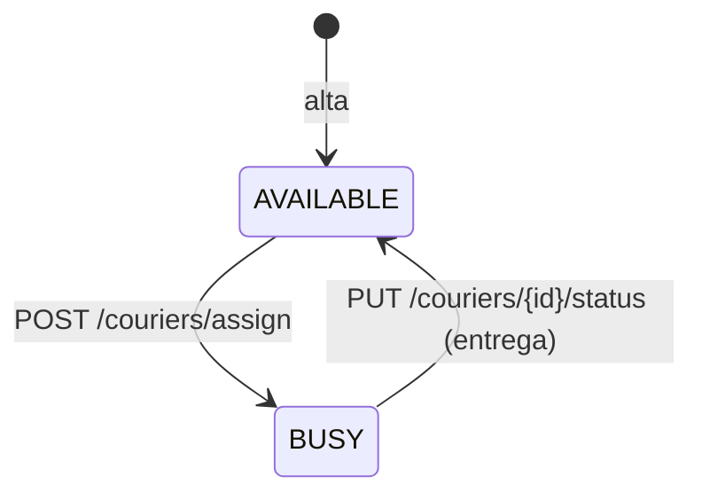

# 003 · Cambiar el estado de un repartidor

- **Estado:** Implementado
- **Servicio:** courier-svc
- **Requisitos de sistema:** RS-07

## Historia de usuario

Como servicio de pedidos, quiero liberar al repartidor al entregar un pedido, para que pueda recibir otro.

## Requisitos funcionales

- **RF-1** `PUT /couriers/{id}/status` con `{"status": "..."}` actualiza el estado; 404 si el id no existe.
- **RF-2** Con `AVAILABLE` el repartidor vuelve al set `couriers:available`; con cualquier otro valor (se usa `BUSY`) sale de ese set.

## Escenarios de aceptación

1. **Dado** un repartidor `BUSY`, **cuando** se envía `AVAILABLE`, **entonces** vuelve a poder ser asignado.
2. **Dado** un id inexistente, **cuando** se cambia el estado, **entonces** responde 404.

## Estados

## Fuera de alcance / notas

- Hoy se acepta cualquier texto como estado; solo `AVAILABLE` y `BUSY` tienen significado.
